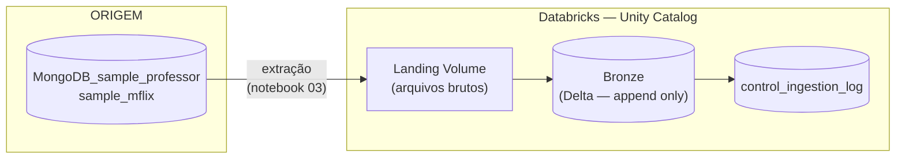
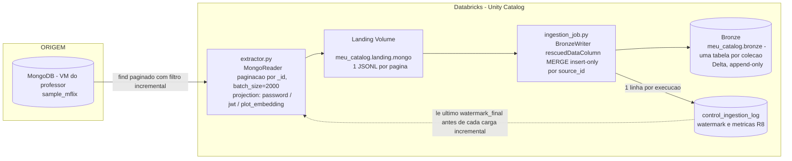

# Arquitetura — Ingestão sample_mflix

> Documente aqui a arquitetura **real** da sua solução.
> O diagrama abaixo é um ponto de partida — substitua pelo da sua implementação.
> Aluno: Lincoln Sanders Moreira Gomes.
> Matrícula: 2651429.
> E-mail: lincoln.106sanders@gmail.com
---

## Fluxo esperado



---

## Camadas

### Landing
- Volume no Unity Catalog: `<catalog>.landing.mflix`
- Arquivos depositados pelo job de extração
- Um arquivo por coleção por execução
- Nomenclatura: `<collection>/<collection>_<timestamp>.<formato>`

### Bronze
- Tabela Delta registrada no Unity Catalog: `catalog.bronze.<collection>`
- Append-only — sem transformação de negócio
- Particionada por `_ingestion_date`
- Colunas de rastreabilidade obrigatórias (R4 do enunciado)

A gravação na Bronze é feita pela classe `BronzeWriter` (dentro de
`src/ingestion_job.py`), lendo os arquivos JSONL da landing e aplicando:

**Schema flexível (R7):** a leitura usa a opção `rescuedDataColumn`, que
captura em uma coluna `_rescued_data` qualquer campo que não bata com o
schema inferido no momento daquele lote — nada é descartado silenciosamente.
Isso é necessário porque cada execução incremental só enxerga o subconjunto
de documentos novos daquele lote, então o schema inferido pode variar entre
execuções (um campo raro presente em documentos antigos pode não aparecer
no lote atual).

**Rastreabilidade (R4):** toda linha recebe `_source_id` (o `_id` original
do MongoDB, como string), `_ingestion_id` (UUID da execução),
`_ingestion_timestamp`, `_source_path`, `_load_type` (full/incremental) e
`_ingestion_date` — esta última usada como coluna de particionamento
(`partitionBy`) da tabela Delta.

**Idempotência (R3/R6):** a gravação usa `MERGE ... WHEN NOT MATCHED THEN
INSERT *` (sintaxe SQL, não a API Python `DeltaMergeBuilder`, por
incompatibilidade com compute Serverless), casando por `_source_id`. A
operação nunca executa UPDATE nem DELETE em linha já existente — apenas
insere documentos com `_source_id` que ainda não está na tabela. Isso
garante que reexecutar o pipeline não duplica registros (evidência em
`docs/EVIDENCIAS/`) e mantém a Bronze estritamente append-only, sem
transformação de negócio.

**Reconciliação (R8):** antes de cada MERGE, comparamos a quantidade de
documentos lidos da origem contra a lida na landing, o percentual de
`_source_id` nulo e a quantidade de duplicados no lote. Se a divergência
ultrapassar o limiar configurado por coleção em `config/collections.json`
(campo `reconciliation_threshold_pct`), ou se houver qualquer nulo/
duplicado, a execução é marcada `PARTIAL` na `control_ingestion_log` em vez
de `SUCCESS` — a Bronze recebe os dados normalmente, mas fica sinalizado
para investigação.

### Control
- Tabela `<catalog>.bronze.control_ingestion_log`
- Uma linha por execução por coleção

---

## Decisões técnicas

**Formato dos arquivos na landing:**
```
Decisão: JSONL, 1 arquivo por paginação na extração com um tamanho de batch = 2000, ao invés de 1 arquivo por documento.
Justificativa: Utilização de paginação a partir de um tamanho de batch razoável evita problemas de smallfiles (o que impacta em perfomance de leitura), 
e evita problemas relacionados à memória quando há gravação de coleções inteiras em um só arquivo.
Ademais a landing deve evitar sobremaneira a tipagem de schemas no momento da escrita para evitar perda de dados e criar uma cópia fiel dos dados na origem.
```

**Trigger do job Bronze:**
```
Decisão: Scheduled / Síncrono — extração na landing e gravação na Bronze
acontecem na mesma execução do job, sem streaming, checkpoint ou trigger
por chegada de arquivo.
Justificativa: 
    A opção do pipeline síncrono foi escolhida para reduzir a complexidade do trabalho, gerenciamento de checkpoint, modo de evolução de schema em streaming e a necessidade de reescrever a lógica de MERGE idempotente como foreachBatch o Auto Loader por padrão só faz append em modo streaming, isso adicionaria risco para o escopo obrigatório. 
    Limitação assumida: a camada Bronze só reflete o estado da origem até a última execução manual/agendada do job, sem atualização em tempo real.
```

**Estratégia de idempotência na Bronze:**
```
Decisão: MERGE insert-only por _source_id = o _id do MongoDB — a
operação nunca executa UPDATE nem DELETE em uma linha já existente,
apenas insere documentos cujo _source_id ainda não está na tabela.
Justificativa:
    Garantia direta de imdepotência ao reexecutar a pipeline, ao reexecutar a pipeline a td_gravada_destino = , apresenta valor nulo a partir de segunda execução. 
    Limitações assumidas: Caso haja alteração na origem em umdocumento que já foi ingerido, o filtro incremental por watermark volta a capturá-lo na extração, mas como a o _id já existe na bronze o merge tende a ignorar e essa edição não é refletida. Essa limitação é assumida por que mesmo sem trnasofmrção por regras de negócio, mudanças na origem já tipificam uma mudança de linha existente, o que agride a integridade de dados que deve existir na camada bronze, então toda mudança na origem é inserida, não atualizada. Mudanças nesses aspectos devem ser de responsabilidade da camada seguinte (Prata).
```

**Tratamento de schema drift:**
```
Decisão: leitura da landing com a opção rescuedDataColumn, direcionando
para uma coluna _rescued_data qualquer conteúdo que não seja compatível
com o schema inferido no momento da leitura daquele lote.
Justificativa: 
    Como cada execução incremental processa apenas o subconjunto de documentos novos daquela batch, o schema é inferido a partir desse subconjunto — um campo presente em documentos anteriores mas ausente no lote atual simplesmente não entraria no schema inferido dessa execução, descartar esses documentos viola a premissa de preservação da informação na origem.
    A decisão de falhar a execução interia por causa de divergÇencias tornaria fragil extrações de grande volume. A opção de _rescued_data absorve todo tipo de informação mesmo que divergente mas deixa o tratamento (tipagem) para uma camada superior.
```

**Modos de carga por coleção:**

| Coleção | Modo | Watermark field | Justificativa |
|---|---|---|---|
| movies | 	incremental| lastupdated (string)| Volume relevante (~21-23 mil documentos) torna full load repetitivo e caro a cada execução. O campo existe em praticamente todo documento e reflete a última atualização na origem, mesmo sendo string em vez de Date nativo — a comparação lexicográfica funciona porque o formato (YYYY-MM-DD HH:MM:SS.nnnnnnnnn) é fixo e consistente em toda a coleção.|
| comments | 	incremental| date (ISODate)| Maior volume da base (~50 mil documentos) — full load seria o mais custoso de todos, sem necessidade. date é Date nativo do MongoDB, então a comparação $gt é direta e confiável, sem a ressalva de formato que existe em movies.|
| users |	full |- | Volume pequeno (~185 documentos): custo de reprocessar tudo é desprezível. Não há campo de atualização confiável na origem para usar como watermark, e mesmo que houvesse, o ganho de implementar carga incremental para uma coleção desse tamanho não compensaria a complexidade adicional. Campo password excluído via projection — não tem valor analítico e expor um hash na Bronze é risco de segurança desnecessário.|
| theaters | full| -| 	Volume pequeno-médio (~1.500 documentos), sem campo de última atualização identificado no schema. O custo de reler a coleção inteira a cada execução é baixo o suficiente para não justificar o esforço de mapear um watermark artificial.|
| sessions | 	full|- | 	Volume pequeno-médio (uma doc apenas). Carga incremental não faz sentido nessa escala — o pipeline trata explicitamente o caso de 0 documentos sem lançar exceção. Campo jwt excluído via projection (token de sessão ativo, sem valor analítico e sensível).|
| embedded_movies | full| -| Mesmo volume moderado de movies (3.500) decidimos manter full load por simplicidade, já que o custo de reprocessar é bem menor que o de comments/movies. Campo plot_embedding excluído via projection — vetor de ~1536 floats por documento (12 KB cada), sem necessidade na camada Bronze e com impacto real de volume (42 MB só de embeddings na coleção inteira).|
| Racional | Coleções grandes - Incremental| Coleções Pequenas - Full
---

## Divergências em relação à estrutura sugerida

| Sugerido pelo professor | O que implementamos | Justificativa |
|---|---|---|
| Pasta `jobs/` | Pasta `src/` | Convenção que já estava em uso desde o início do desenvolvimento; o conteúdo e a organização interna seguem o mesmo princípio (extração separada da orquestração), só o nome da pasta diverge. |
| `jobs/ingestion_job.py` + `jobs/bronze_job.py` (separados) | `src/extractor.py` + `src/ingestion_job.py` | A lógica de gravação na Bronze (`BronzeWriter`) e de controle de execução (`IngestionControl`) ficaram consolidadas dentro de `ingestion_job.py`, junto com a orquestração (`process_collection`/`run_all`), em vez de um `bronze_job.py` separado. Optamos por isso para manter a lógica de escrita e a orquestração que a invoca no mesmo arquivo, reduzindo o número de imports cruzados entre módulos pequenos. |
| `config/pipeline_config.yaml` + `config/collections.json` (dois arquivos) | Só `config/collections.json` | Consolidamos toda a configuração (parâmetros globais — catalog, schemas, secret scope, batch_size — e parâmetros por coleção) em um único arquivo JSON, em vez de dividir entre YAML e JSON. Escolhemos manter um formato só para simplificar o carregamento (`load_config`) e evitar duas fontes de verdade para configuração. |

---

## Evidências de execução

Disponíveis nos notebooks `notebooks/Execucao.py`, `notebooks/Execucao_incremental.py`
e `notebooks/Validacao.py`, nos prints salvos em `docs/EVIDENCIAS/`, e na
tabela `meu_catalog.bronze.control_ingestion_log`.

## Diagrama da sua solução


