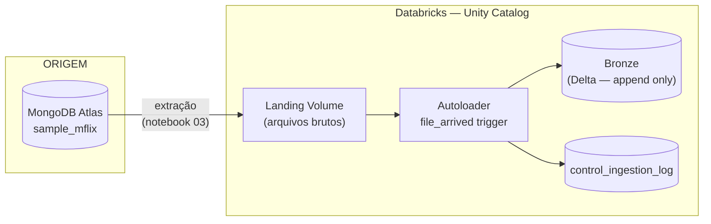

# Arquitetura — Ingestão sample_mflix

> Documente aqui a arquitetura **real** da sua solução.
> O diagrama abaixo é um ponto de partida — substitua pelo da sua implementação.

---

## Fluxo esperado



---

## Camadas

### Landing
- Volume no Unity Catalog: `<catalog>.landing.mflix`
- Arquivos depositados pelo job de extração
- Um arquivo por coleção por execução
- Nomenclatura: `<collection>/<collection>_<timestamp>.<formato>`

### Bronze
- Tabela Delta registrada no Unity Catalog: `<catalog>.bronze.<collection>`
- Append-only — sem transformação de negócio
- Particionada por `_ingestion_date`
- Colunas de rastreabilidade obrigatórias (R4 do enunciado)

### Control
- Tabela `<catalog>.bronze.control_ingestion_log`
- Uma linha por execução por coleção

---

## Decisões técnicas (preencha)

**Formato dos arquivos na landing:**
```
Decisão: ...
Justificativa: ...
```

**Trigger do job Bronze:**
```
Decisão: [file_arrived / scheduled / continuous]
Justificativa: ...
```

**Estratégia de idempotência na Bronze:**
```
Decisão: ...
Justificativa: ...
```

**Tratamento de schema drift:**
```
Decisão: ...
Justificativa: ...
```

**Modos de carga por coleção:**

| Coleção | Modo | Watermark field | Justificativa |
|---|---|---|---|
| movies | | | |
| comments | | | |
| users | | | |
| theaters | | | |
| sessions | | | |
| embedded_movies | | | |

---

## Diagrama da sua solução

```
[ substitua pelo diagrama real ]
```
