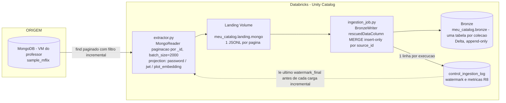

# Arquitetura — Diagrama

> Decisões técnicas, justificativas e detalhamento de cada camada estão no
> [`README.md`](../README.md) na raiz do repositório. Este arquivo contém
> só o diagrama da solução.

